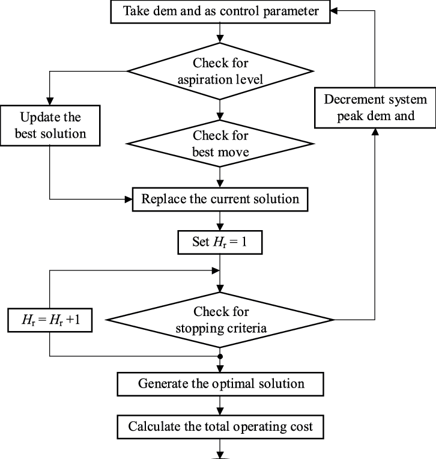

# OR_scheduling_project
- Authors: [Kyuhee Jo](kjo3@jhu.edu), [Cyrus Mintz](cmintz2@jhmi.edu)
- Automatic OR scheduling for Johns Hopkins Hospital

## The Task

  Operating room schedules are manually devised each day according to a long list of rule structures. There are three types of staffs and each staff type has specific rules regarding maximum coverage which apply in all areas.
  
----
- **Attendings (ATTG)**: Can be in one room without staff (solo attending coverage), up to two rooms with any combination including a resident (2:1 coverage), or up to three rooms if all assigned staff are nurse anesthetists (3:1 coverage).

- **Residents (RES)**: Can be in only one room. Require attending in faculty column to function. One attending can cover up to two rooms if one room has a resident assigned as staff. Single coverage of resident (1:1) is permissible in certain circumstances.

- **Nurse anesthetists (CRNA)**: Can be in only one room. Require attending in faculty column to function. One attending can cover up to three rooms if all rooms are CRNAs. Single coverage of nurse anesthetists (1:1) is permissible in certain circumstances.
----
  
  Depending on the specific area, there are combinations of staffings that are required, preferred, or forbidden. Hence, the program aims to produce an optimized solution that (1) satisfies the given rules (2) minimizes the number of attendings and (3) satisfies as many preferred situation as possible. The input information is the number of residents/nurses present on call as well as the number and location of operating rooms that needs staffing in a given day. 

  The problem could be interpereted as a type of Nurse scheduling/combinatorial optimization problem, with some hard constraints, soft constraints and cost (= number of Attendings) that needs to be minimized. The goal, restated in such term, is to find out a combination that satisfies hard constraints & minimizes the number of attendings required given the total available number of residents and nurses. 
  
  Each area is defined as a separate class that inherits same interface (area), with the following fields: **{ Number of Rooms: int, Number of CRNA (nurse): int, Number of Residents: int, Number of Solo attendings: int }** where rooms = CRNA + Resident + Solo. Each room needs to have one of CRNA or Resident or a Solo attending. Furthermore, the area interface has three main methods to solve the problem:  

| Methods        | What it does |
| ------------- | ------------- |
| **IsValid** | Checks if the given combination satisfies the hard constraints (e.g. maximum number of solo etc.)  |
| **IsPreferred** | Checks soft constraints (e.g. preferred ratio / preferred staffs) |
| **Calculate Cost** | calculates the number of attendings required for the given area based on the allowed ratio/rules |

  In order to assign the right numbers of staffings to each area given a budget of CRNAs, Residents, and Solo Attendings, I applied **Tabu Search**, a heuristic algorithm, to randomly assign numbers to each area and performing local search to search for neighbors that are superior solution. 
 

## What is Tabu Search? 

[Tabu Search](https://towardsdatascience.com/optimization-techniques-tabu-search-36f197ef8e25) is a commonly used meta-heuristic used for optimizing model parameters. A meta-heuristic is a general strategy that is used to guide and control actual heuristics. Tabu Search is often regarded as integrating memory structures into local search strategies. As local search has a lot of limitations, Tabu Search is designed to combat a lot of those issues.

In this problem we start by adding staffs one by one based on predefined priorities betwen areas. If adding a staff makes the solution obsolete (i.e., violates the hard constraint) that operation is saved and maintained in Tabu List. The process is repeated until we fill in all operating rooms. The solution with least number of staffings (i.e. minimum cost) is selected.  

## How to use 

The program takes in as an input the excel file that annotates the number and area of operating rooms that need scehduling. README.docx contains detailed instructions to use the program to generate schedules from excel sheet. 

## Citation

https://towardsdatascience.com/optimization-techniques-tabu-search-36f197ef8e25
